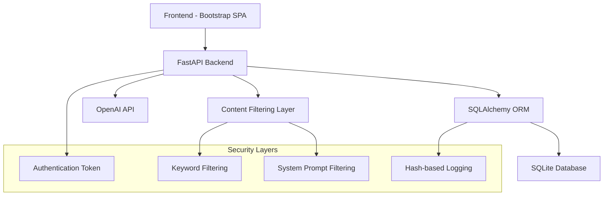

# Design Document

## Overview

The Healthcare Chatbot MVP is a web-based application consisting of a FastAPI backend with SQLAlchemy ORM for data persistence and a single-page frontend built with Bootstrap. The system implements a secure, healthcare-focused AI chatbot with dual-layer content filtering, authentication, and privacy-preserving logging.

## Architecture

### System Architecture



### Technology Stack

- **Backend**: FastAPI with Python 3.8+
- **Database**: SQLAlchemy with SQLite (configurable)
- **Frontend**: Vanilla JavaScript with Bootstrap 5.3.3
- **AI Integration**: OpenAI GPT-4o-mini via HTTP API
- **Security**: Token-based authentication, SHA256/HMAC256 hashing

## Components and Interfaces

### Backend Components

#### 1. Main Application (`main.py`)
- **Purpose**: Central FastAPI application with route handlers
- **Dependencies**: FastAPI, CORS middleware, static file serving
- **Key Routes**:
  - `GET /`: Serves the main HTML interface
  - `POST /api/login`: Handles user authentication
  - `POST /api/chat`: Processes chat messages with AI integration

#### 2. Database Layer (`db.py`)
- **Purpose**: SQLAlchemy configuration and models
- **Components**:
  - Database engine configuration with SQLite support
  - Session management with proper connection handling
  - `ChatLog` model for storing hashed interaction data
  - Database initialization function

#### 3. Data Models (`models.py`)
- **Purpose**: Pydantic models for API request/response validation
- **Models**:
  - `LoginIn`: Email and password validation
  - `LoginOut`: Authentication response with token
  - `ChatIn`: Chat message with optional token
  - `ChatOut`: AI response wrapper

#### 4. Security Module (`security.py`)
- **Purpose**: Cryptographic functions for data protection
- **Functions**:
  - `sha256_hex()`: Standard SHA256 hashing
  - `hmac256_hex()`: HMAC-based hashing with secret key
  - Environment-based secret management

#### 5. Content Filtering System
- **Dual-Layer Approach**:
  - **Layer 1**: Server-side keyword filtering for fast rejection
  - **Layer 2**: AI model system prompt for intelligent filtering
- **Healthcare Keywords**: Comprehensive list covering medical terminology
- **Refusal Mechanism**: Standardized rejection message

### Frontend Components

#### 1. Single Page Application (`index.html`)
- **Authentication View**: Login form with demo credential option
- **Chat Interface**: Real-time messaging with AI assistant
- **Responsive Design**: Mobile-first approach with Bootstrap grid
- **State Management**: JavaScript-based view switching

#### 2. UI/UX Design Elements
- **Color Scheme**: Healthcare-themed blues and whites
- **Typography**: System fonts for optimal readability
- **Icons**: Bootstrap Icons for consistent iconography
- **Animations**: Subtle shadows and gradients for modern feel

## Data Models

### Database Schema

#### ChatLog Table
```sql
CREATE TABLE chat_logs (
    id INTEGER PRIMARY KEY AUTOINCREMENT,
    hashed_query VARCHAR(128) NOT NULL,
    hashed_response VARCHAR(128) NOT NULL,
    timestamp DATETIME NOT NULL DEFAULT CURRENT_TIMESTAMP,
    INDEX idx_hashed_query (hashed_query),
    INDEX idx_timestamp (timestamp)
);
```

### API Data Models

#### Authentication Flow
```json
// Login Request
{
  "email": "string",
  "password": "string"
}

// Login Response
{
  "token": "string",
  "message": "string"
}
```

#### Chat Flow
```json
// Chat Request
{
  "message": "string",
  "token": "string"
}

// Chat Response
{
  "reply": "string"
}
```

## Error Handling

### Backend Error Handling
1. **Authentication Errors**: HTTP 401 for invalid tokens, HTTP 400 for missing credentials
2. **Validation Errors**: HTTP 400 with descriptive messages for invalid input
3. **API Failures**: Graceful fallback to mock responses when OpenAI API unavailable
4. **Database Errors**: Proper session management with automatic rollback

### Frontend Error Handling
1. **Network Failures**: User-friendly error messages for API communication issues
2. **Authentication Failures**: Clear feedback and return to login state
3. **Input Validation**: Client-side validation before API calls
4. **Loading States**: Visual indicators during API processing

### Content Filtering Error Handling
1. **Keyword Filter**: Fast rejection with immediate refusal message
2. **AI Filter Bypass**: Secondary check to override inappropriate AI responses
3. **API Timeout**: Fallback to safe default responses

## Testing Strategy

### Backend Testing
1. **Unit Tests**:
   - Security functions (hashing, token validation)
   - Content filtering logic
   - Database operations
   - API endpoint responses

2. **Integration Tests**:
   - Full authentication flow
   - Chat message processing with mock AI responses
   - Database persistence and retrieval
   - Error handling scenarios

3. **API Testing**:
   - OpenAI integration with various query types
   - Rate limiting and timeout handling
   - Content filtering effectiveness

### Frontend Testing
1. **UI Testing**:
   - Responsive design across devices
   - Form validation and submission
   - Chat interface functionality
   - State transitions between views

2. **Integration Testing**:
   - End-to-end user flows
   - API communication
   - Error state handling
   - Authentication persistence

### Security Testing
1. **Content Filtering**:
   - Healthcare vs non-healthcare query classification
   - System prompt effectiveness
   - Edge cases and bypass attempts

2. **Data Privacy**:
   - Hash function verification
   - Database content inspection
   - Token security validation

## Configuration Management

### Environment Variables
- `OPENAI_API_KEY`: OpenAI API authentication (optional for mock mode)
- `DB_URL`: Database connection string (defaults to SQLite)
- `APP_SECRET`: HMAC secret key for enhanced security

### Deployment Considerations
1. **Development Mode**: SQLite database with demo credentials
2. **Production Mode**: Configurable database backend with proper secrets management
3. **Static Assets**: Efficient serving of frontend resources
4. **CORS Configuration**: Appropriate origin restrictions for production

## Performance Considerations

### Backend Optimization
1. **Database Indexing**: Optimized queries on hashed_query and timestamp fields
2. **Connection Pooling**: Efficient SQLAlchemy session management
3. **Async Operations**: FastAPI async support for OpenAI API calls
4. **Caching Strategy**: Potential for response caching on repeated queries

### Frontend Optimization
1. **Single File Approach**: Minimal HTTP requests for faster loading
2. **CDN Resources**: Bootstrap and icons served from CDN
3. **Efficient DOM Updates**: Minimal JavaScript for chat interface updates
4. **Mobile Performance**: Optimized responsive design